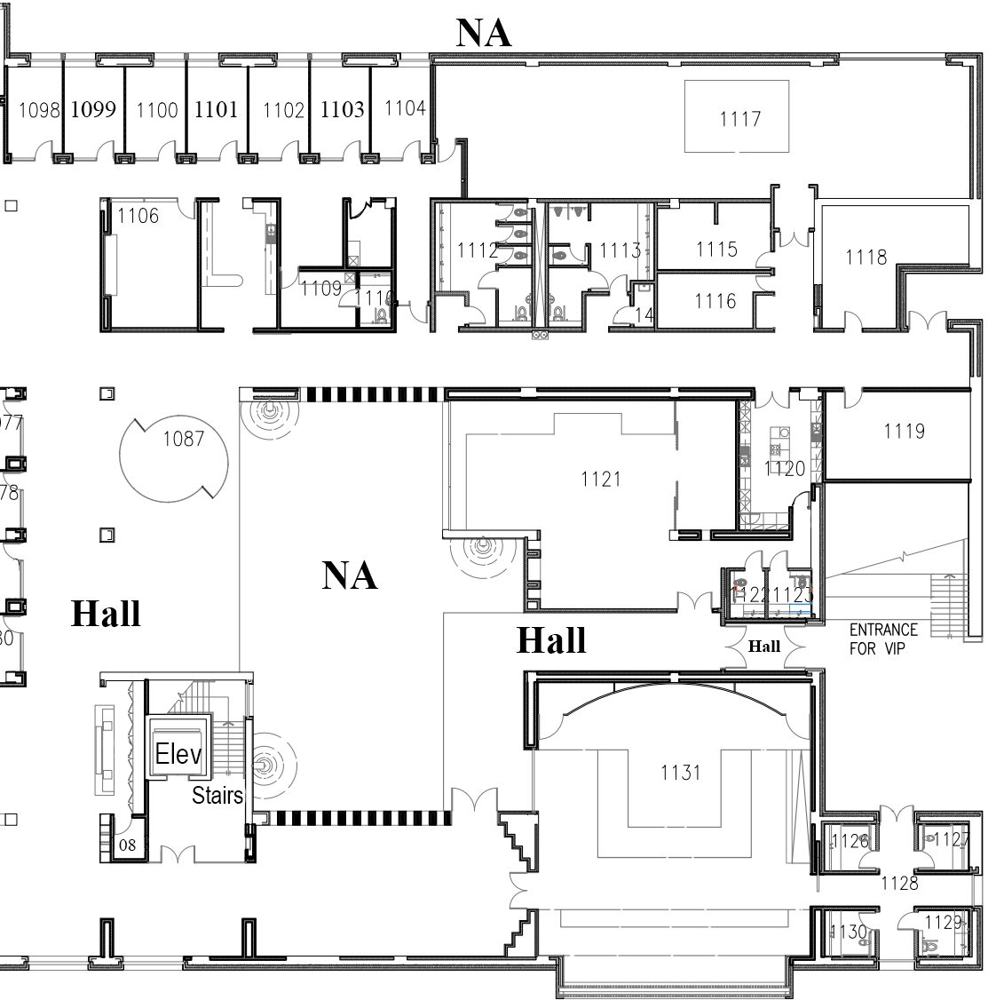
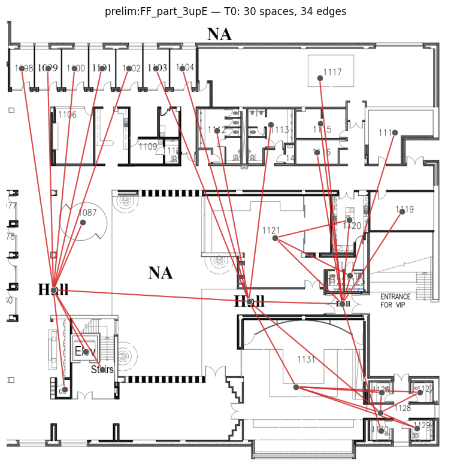
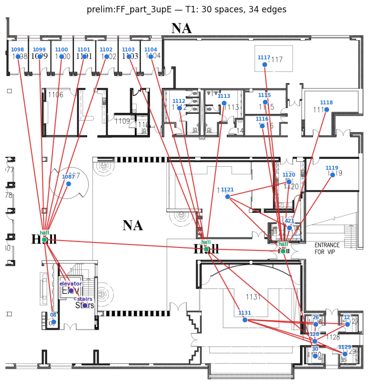
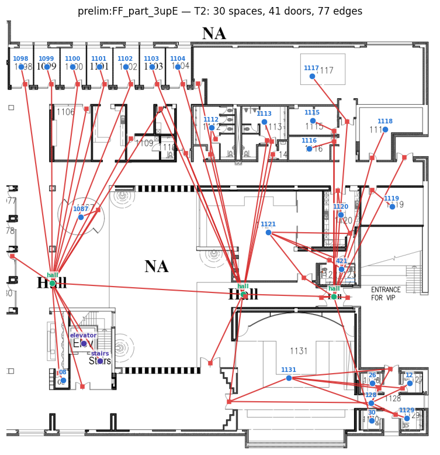
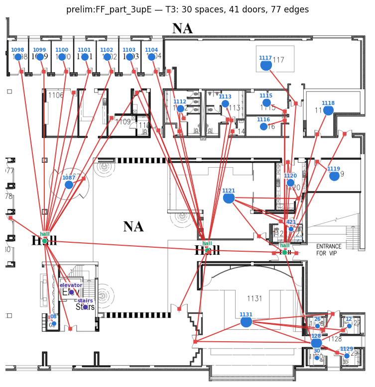

# FF_part_3upE

| tier | spaces | doors | edges | labeled spaces |
|---|---|---|---|---|
| T0 | 30 | — | 34 | — |
| T1 | 30 | — | 34 | 30 |
| T2 | 30 | 41 | 77 | 30 |
| T3 | 30 | 41 | 77 | 30 |

## Source

## T0

## T1

## T2

## T3

Tier JSONs: `tiers/T0.json` … `tiers/T3.json` (schema v2, validated).
T4/T5 (direction, zones) await the manual annotation stage-gate (D-014).
