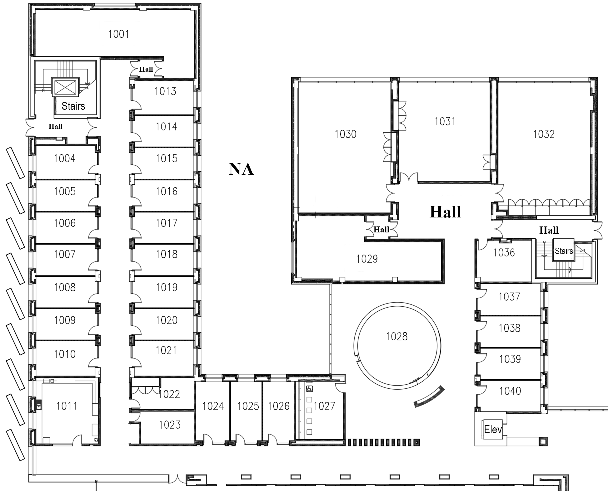
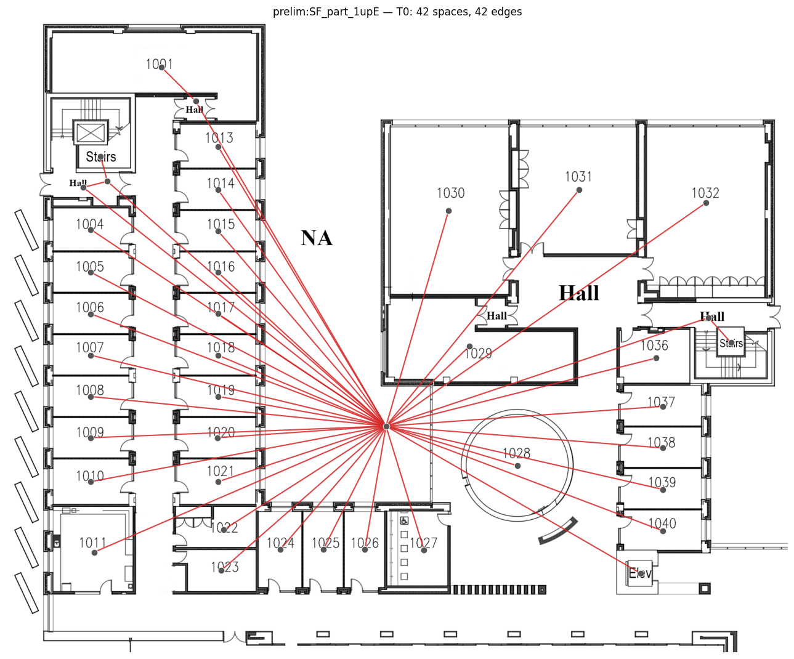
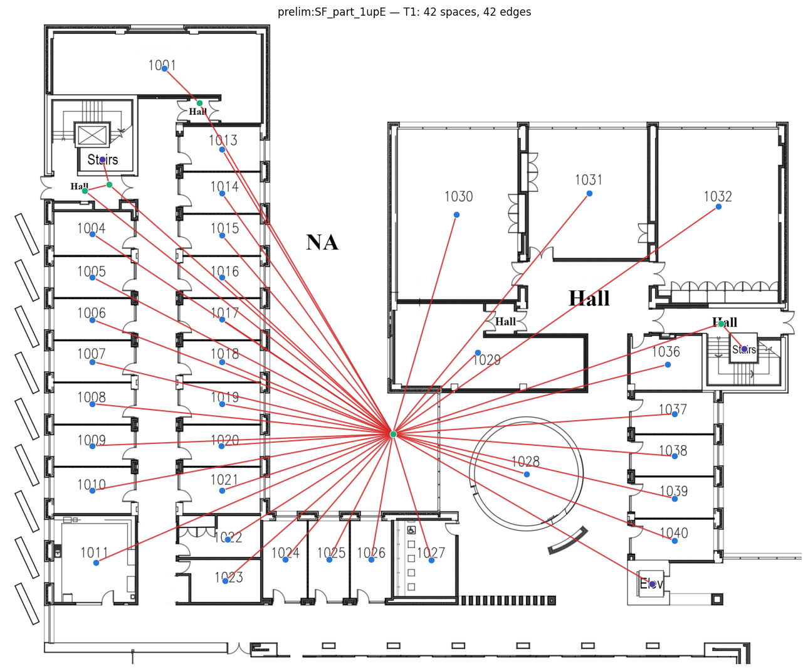
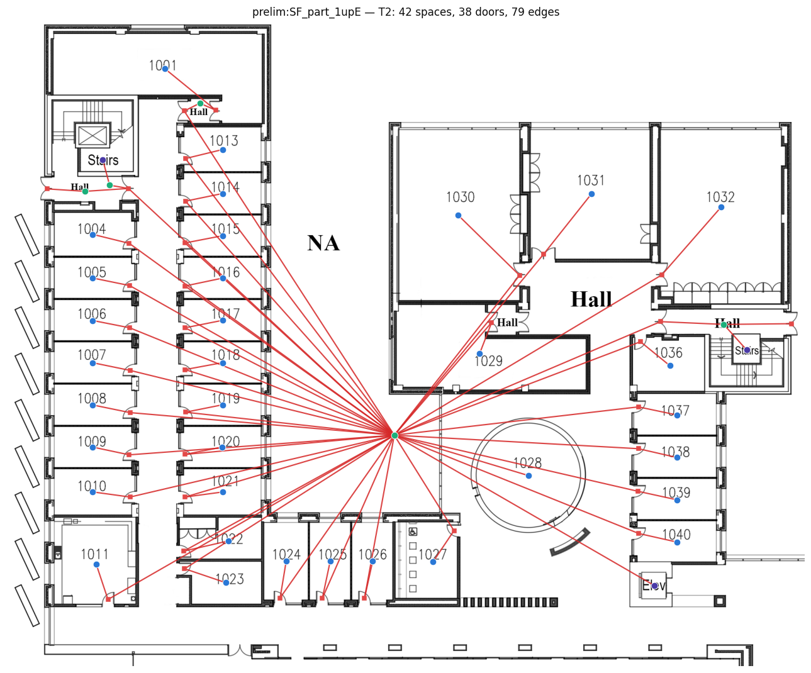
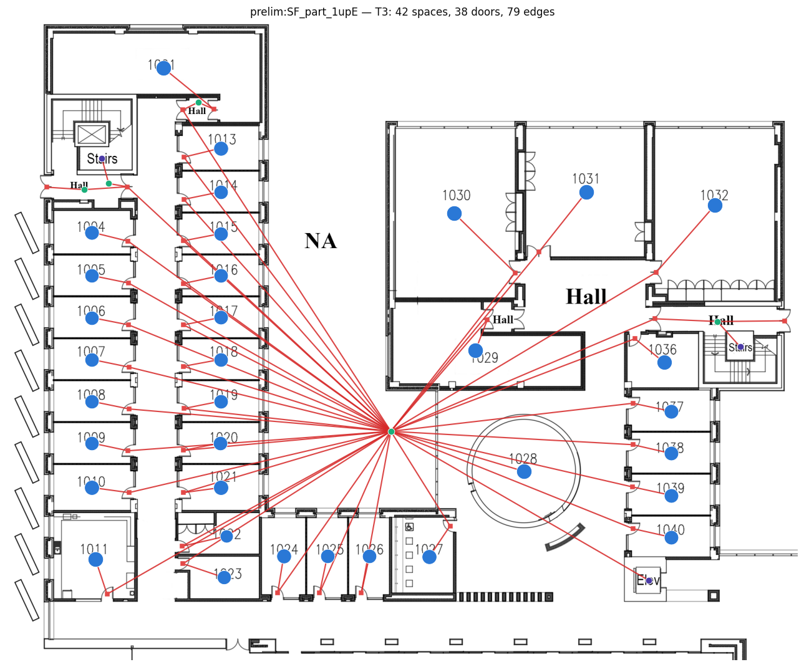

# SF_part_1upE

| tier | spaces | doors | edges | labeled spaces |
|---|---|---|---|---|
| T0 | 42 | — | 42 | — |
| T1 | 42 | — | 42 | 8 |
| T2 | 42 | 38 | 79 | 8 |
| T3 | 42 | 38 | 79 | 8 |

## Source

## T0

## T1

## T2

## T3

Tier JSONs: `tiers/T0.json` … `tiers/T3.json` (schema v2, validated).
T4/T5 (direction, zones) await the manual annotation stage-gate (D-014).
