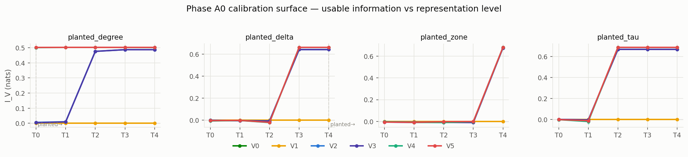
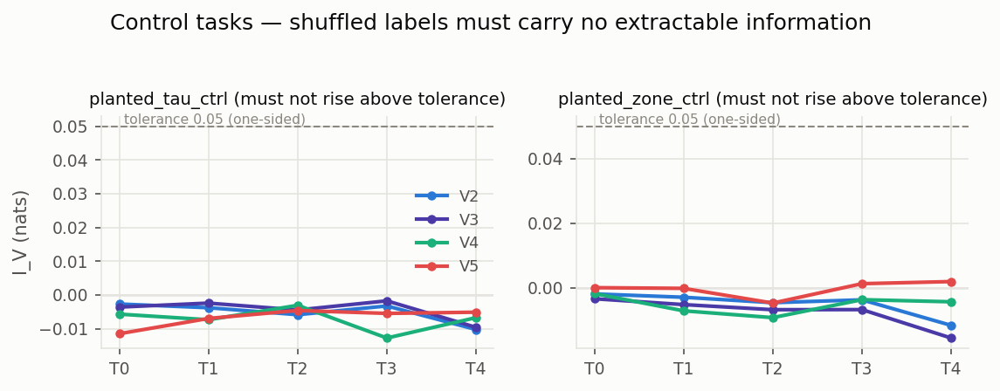

# Phase A0 — instrument calibration report

**Verdict: PASS ✅**

The measuring instrument (V-information probing protocol) is run on
synthetic buildings where each target is PLANTED at a known level.
It passes only if the measured usable information jumps exactly at the
planted level and shuffled controls extract nothing (plan §6 Phase A0).

| | |
|---|---|
| run_id | `20260714T032204Z-calibration_a0-s20260714` |
| git SHA | `b7ac89685f99` |
| config | `configs/calibration_a0.yaml` (sha256 `576a67a36af6…`) |
| seed | 20260714 |
| cells | 453 (0 failed) |
| host/job | deepnet2 |

## Calibration surface

Reading guide: each panel is one planted target; the dashed vertical line
marks where the answer was hidden. A correct instrument shows curves that
are ~flat at zero LEFT of the line and jump at/after it — for the families
capable of reading that structure (V2+ linear for attribute counts, V4/V5
GNNs for connectivity, V0 readout for the R4 zone attribute).

## Controls

Negative values are harmless optimization noise; only values ABOVE the
dashed tolerance would indicate leakage/memorization.

## Checks

| check | detail | result |
|---|---|---|
| saturation | planted_degree · V4: I_V@T0 = 0.501 vs max below = 0.000 (margin 0.1) | PASS |
| saturation | planted_degree · V5: I_V@T0 = 0.502 vs max below = 0.000 (margin 0.1) | PASS |
| saturation | planted_tau · V2: I_V@T2 = 0.670 vs max below = -0.001 (margin 0.1) | PASS |
| saturation | planted_tau · V3: I_V@T2 = 0.670 vs max below = 0.000 (margin 0.1) | PASS |
| saturation | planted_tau · V4: I_V@T2 = 0.689 vs max below = -0.002 (margin 0.1) | PASS |
| saturation | planted_tau · V5: I_V@T2 = 0.689 vs max below = -0.002 (margin 0.1) | PASS |
| saturation | planted_delta · V2: I_V@T3 = 0.642 vs max below = -0.001 (margin 0.1) | PASS |
| saturation | planted_delta · V3: I_V@T3 = 0.642 vs max below = -0.002 (margin 0.1) | PASS |
| saturation | planted_delta · V4: I_V@T3 = 0.662 vs max below = -0.003 (margin 0.1) | PASS |
| saturation | planted_delta · V5: I_V@T3 = 0.662 vs max below = -0.002 (margin 0.1) | PASS |
| saturation | planted_zone · V0: I_V@T4 = 0.679 vs max below = 0.000 (margin 0.1) | PASS |
| saturation | planted_zone · V2: I_V@T4 = 0.675 vs max below = -0.003 (margin 0.1) | PASS |
| saturation | planted_zone · V3: I_V@T4 = 0.675 vs max below = -0.006 (margin 0.1) | PASS |
| saturation | planted_zone · V4: I_V@T4 = 0.680 vs max below = -0.002 (margin 0.1) | PASS |
| saturation | planted_zone · V5: I_V@T4 = 0.680 vs max below = -0.001 (margin 0.1) | PASS |
| control | control planted_tau_ctrl · V2 @T0: I_V = -0.003 (< tol, one-sided) | PASS |
| control | control planted_tau_ctrl · V2 @T1: I_V = -0.004 (< tol, one-sided) | PASS |
| control | control planted_tau_ctrl · V2 @T2: I_V = -0.006 (< tol, one-sided) | PASS |
| control | control planted_tau_ctrl · V2 @T3: I_V = -0.003 (< tol, one-sided) | PASS |
| control | control planted_tau_ctrl · V2 @T4: I_V = -0.010 (< tol, one-sided) | PASS |
| control | control planted_tau_ctrl · V3 @T0: I_V = -0.004 (< tol, one-sided) | PASS |
| control | control planted_tau_ctrl · V3 @T1: I_V = -0.002 (< tol, one-sided) | PASS |
| control | control planted_tau_ctrl · V3 @T2: I_V = -0.004 (< tol, one-sided) | PASS |
| control | control planted_tau_ctrl · V3 @T3: I_V = -0.002 (< tol, one-sided) | PASS |
| control | control planted_tau_ctrl · V3 @T4: I_V = -0.010 (< tol, one-sided) | PASS |
| control | control planted_tau_ctrl · V4 @T0: I_V = -0.006 (< tol, one-sided) | PASS |
| control | control planted_tau_ctrl · V4 @T1: I_V = -0.007 (< tol, one-sided) | PASS |
| control | control planted_tau_ctrl · V4 @T2: I_V = -0.003 (< tol, one-sided) | PASS |
| control | control planted_tau_ctrl · V4 @T3: I_V = -0.013 (< tol, one-sided) | PASS |
| control | control planted_tau_ctrl · V4 @T4: I_V = -0.007 (< tol, one-sided) | PASS |
| control | control planted_tau_ctrl · V5 @T0: I_V = -0.011 (< tol, one-sided) | PASS |
| control | control planted_tau_ctrl · V5 @T1: I_V = -0.007 (< tol, one-sided) | PASS |
| control | control planted_tau_ctrl · V5 @T2: I_V = -0.005 (< tol, one-sided) | PASS |
| control | control planted_tau_ctrl · V5 @T3: I_V = -0.005 (< tol, one-sided) | PASS |
| control | control planted_tau_ctrl · V5 @T4: I_V = -0.005 (< tol, one-sided) | PASS |
| control | control planted_zone_ctrl · V2 @T0: I_V = -0.002 (< tol, one-sided) | PASS |
| control | control planted_zone_ctrl · V2 @T1: I_V = -0.003 (< tol, one-sided) | PASS |
| control | control planted_zone_ctrl · V2 @T2: I_V = -0.005 (< tol, one-sided) | PASS |
| control | control planted_zone_ctrl · V2 @T3: I_V = -0.004 (< tol, one-sided) | PASS |
| control | control planted_zone_ctrl · V2 @T4: I_V = -0.012 (< tol, one-sided) | PASS |
| control | control planted_zone_ctrl · V3 @T0: I_V = -0.003 (< tol, one-sided) | PASS |
| control | control planted_zone_ctrl · V3 @T1: I_V = -0.005 (< tol, one-sided) | PASS |
| control | control planted_zone_ctrl · V3 @T2: I_V = -0.007 (< tol, one-sided) | PASS |
| control | control planted_zone_ctrl · V3 @T3: I_V = -0.007 (< tol, one-sided) | PASS |
| control | control planted_zone_ctrl · V3 @T4: I_V = -0.016 (< tol, one-sided) | PASS |
| control | control planted_zone_ctrl · V4 @T0: I_V = -0.002 (< tol, one-sided) | PASS |
| control | control planted_zone_ctrl · V4 @T1: I_V = -0.007 (< tol, one-sided) | PASS |
| control | control planted_zone_ctrl · V4 @T2: I_V = -0.009 (< tol, one-sided) | PASS |
| control | control planted_zone_ctrl · V4 @T3: I_V = -0.004 (< tol, one-sided) | PASS |
| control | control planted_zone_ctrl · V4 @T4: I_V = -0.004 (< tol, one-sided) | PASS |
| control | control planted_zone_ctrl · V5 @T0: I_V = +0.000 (< tol, one-sided) | PASS |
| control | control planted_zone_ctrl · V5 @T1: I_V = -0.000 (< tol, one-sided) | PASS |
| control | control planted_zone_ctrl · V5 @T2: I_V = -0.005 (< tol, one-sided) | PASS |
| control | control planted_zone_ctrl · V5 @T3: I_V = +0.001 (< tol, one-sided) | PASS |
| control | control planted_zone_ctrl · V5 @T4: I_V = +0.002 (< tol, one-sided) | PASS |

_Regenerate with `scripts/make_reports.py` — figures are derived from the
run's cell records; nothing here is hand-entered._
