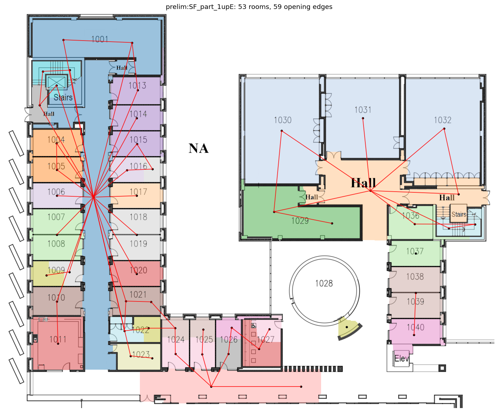
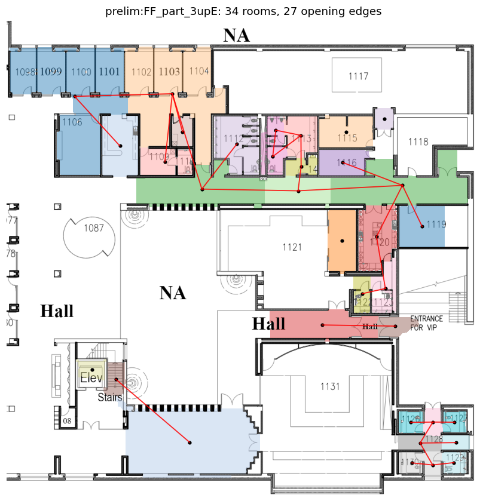
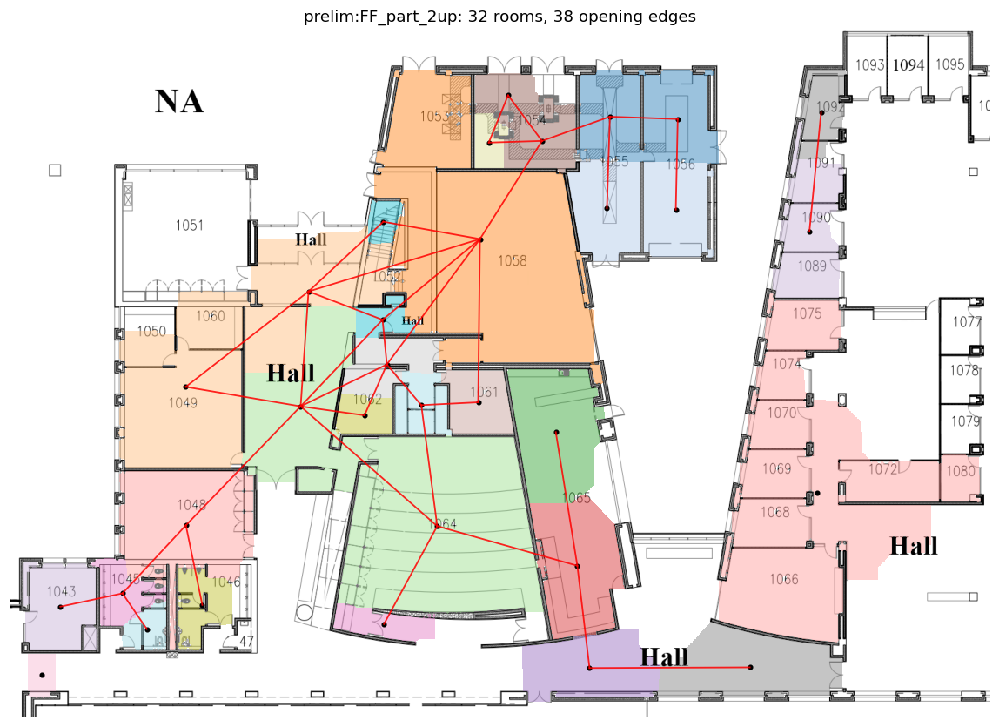
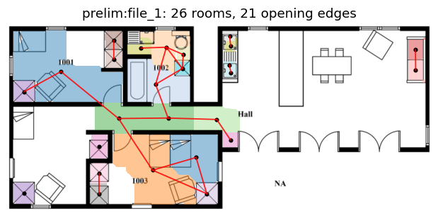
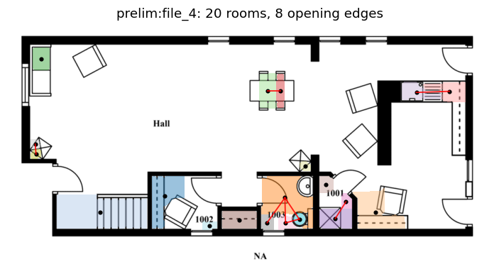

# DATA-0 — raster→graph ingest report (prelim pool)

Every user-supplied floorplan raster is segmented into rooms (hierarchical
multi-scale marker watershed on the free-space distance transform), turned
into a validated R0 connectivity graph, and given preliminary PDE heat
labels. QA overlays below show segmentation + graph over the source sheet.

**21 ingested OK · 0 failed** · 10 duplicate text-variants deduped · 4 non-floorplans skipped

| file | status | rooms | opening edges | wall-only adj | auto split px |
|---|---|---|---|---|---|
| FF part 1upE.png | ok | 53 | 59 | 44 | 28 |
| FF part 2up.png | ok | 32 | 38 | 18 | 24 |
| FF part 3upE.png | ok | 34 | 27 | 29 | 16 |
| FF part 4up.png | ok | 17 | 9 | 6 | 24 |
| FF part 5up.png | ok | 3 | 0 | 2 | 8 |
| FF part 6up.png | ok | 23 | 18 | 10 | 24 |
| FF part 7up.png | ok | 6 | 0 | 1 | 28 |
| FF part 8up.png | ok | 11 | 5 | 3 | 32 |
| LF part 1.png | ok | 12 | 11 | 2 | 20 |
| LF part 2.png | ok | 23 | 11 | 7 | 20 |
| SF part 1upE.png | ok | 53 | 59 | 44 | 28 |
| file_1.png | ok | 26 | 21 | 8 | 12 |
| file_10.png | ok | 9 | 5 | 2 | 16 |
| file_2.png | ok | 5 | 2 | 0 | 24 |
| file_3.png | ok | 13 | 10 | 3 | 24 |
| file_4.png | ok | 20 | 8 | 5 | 8 |
| file_5.png | ok | 10 | 8 | 0 | 24 |
| file_6.png | ok | 4 | 2 | 1 | 28 |
| file_7.png | ok | 7 | 2 | 0 | 24 |
| file_8.png | ok | 20 | 11 | 11 | 8 |
| file_9.png | ok | 12 | 11 | 1 | 28 |

## QA overlays (representative)

### FF part 1upE.png

### SF part 1upE.png

### FF part 3upE.png

### FF part 2up.png

### file_1.png

### file_4.png

All overlays: `data/derived/prelim_rasters/overlays/` (not tracked).

Known limitations (documented in `topospec/data/raster.py`): R0 only —
door/corridor semantics come from the CAD-vector lane or annotation;
stairs/elevators segment as rooms; exterior courtyards can read as
interior on open-site sheets; FF sheets are per-sheet graphs (stitching
into ONE building is part of Gate-b prep). PDE labels are pixel-resolution
preliminaries (no convergence check yet — ROADMAP A-1).

**⚠ file_N residential renders — pipeline smoke tests ONLY, not
measurement data.** Their furniture is drawn with wall-thickness strokes,
so pure morphology over-segments (e.g. file_1: ~40 regions for a 4-room
flat; A/B sweeps of the wall filter either keep furniture or destroy
walls). The institutional FF/LF/SF sheets do NOT have this problem (thin
furniture strokes) and extract cleanly. Real residential corpora arrive
with vector annotations (Structured3D/CubiCasa/MSD — no extraction), and
the FloorPlanCAD lane rasterizes wall primitives only, so this limitation
is confined to these test images.

_Regenerate with `scripts/make_reports.py`._
