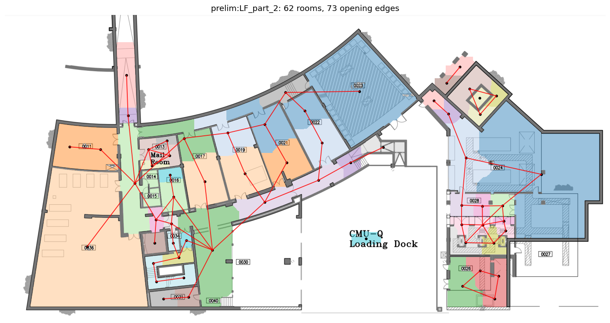

# DATA-0 — raster→graph ingest report (prelim pool)

Every user-supplied floorplan raster is segmented into rooms (hierarchical
multi-scale marker watershed on the free-space distance transform), turned
into a validated R0 connectivity graph, and given preliminary PDE heat
labels. QA overlays below show segmentation + graph over the source sheet.

**11 ingested OK · 10 failed** · 10 duplicate text-variants deduped · 4 non-floorplans skipped

| file | status | rooms | opening edges | wall-only adj | auto split px |
|---|---|---|---|---|---|
| FF part 1upE.png | ok | 99 | 132 | 92 | 28 |
| FF part 2up.png | ok | 81 | 128 | 49 | 24 |
| FF part 3upE.png | ok | 55 | 66 | 45 | 16 |
| FF part 4up.png | ok | 40 | 43 | 19 | 24 |
| FF part 5up.png | ok | 7 | 3 | 3 | 8 |
| FF part 6up.png | ok | 34 | 32 | 23 | 24 |
| FF part 7up.png | ok | 30 | 31 | 25 | 28 |
| FF part 8up.png | ok | 32 | 38 | 17 | 32 |
| LF part 1.png | ok | 20 | 20 | 5 | 20 |
| LF part 2.png | ok | 62 | 73 | 40 | 20 |
| SF part 1upE.png | ok | 99 | 132 | 92 | 28 |
| file_1.png | failed | — | — | — | — |
| file_10.png | failed | — | — | — | — |
| file_2.png | failed | — | — | — | — |
| file_3.png | failed | — | — | — | — |
| file_4.png | failed | — | — | — | — |
| file_5.png | failed | — | — | — | — |
| file_6.png | failed | — | — | — | — |
| file_7.png | failed | — | — | — | — |
| file_8.png | failed | — | — | — | — |
| file_9.png | failed | — | — | — | — |

## Failures

- `file_1.png`: prelim:file_1: no enclosed rooms found at any split radius [8, 12, 16, 20, 24, 28, 32, 40, 48] — image may not match clean-CAD-raster assumptions
- `file_10.png`: prelim:file_10: no enclosed rooms found at any split radius [8, 12, 16, 20, 24, 28, 32, 40, 48] — image may not match clean-CAD-raster assumptions
- `file_2.png`: prelim:file_2: no enclosed rooms found at any split radius [8, 12, 16, 20, 24, 28, 32, 40, 48] — image may not match clean-CAD-raster assumptions
- `file_3.png`: prelim:file_3: no enclosed rooms found at any split radius [8, 12, 16, 20, 24, 28, 32, 40, 48] — image may not match clean-CAD-raster assumptions
- `file_4.png`: prelim:file_4: no enclosed rooms found at any split radius [8, 12, 16, 20, 24, 28, 32, 40, 48] — image may not match clean-CAD-raster assumptions
- `file_5.png`: prelim:file_5: no enclosed rooms found at any split radius [8, 12, 16, 20, 24, 28, 32, 40, 48] — image may not match clean-CAD-raster assumptions
- `file_6.png`: prelim:file_6: no enclosed rooms found at any split radius [8, 12, 16, 20, 24, 28, 32, 40, 48] — image may not match clean-CAD-raster assumptions
- `file_7.png`: prelim:file_7: no enclosed rooms found at any split radius [8, 12, 16, 20, 24, 28, 32, 40, 48] — image may not match clean-CAD-raster assumptions
- `file_8.png`: prelim:file_8: no enclosed rooms found at any split radius [8, 12, 16, 20, 24, 28, 32, 40, 48] — image may not match clean-CAD-raster assumptions
- `file_9.png`: prelim:file_9: no enclosed rooms found at any split radius [8, 12, 16, 20, 24, 28, 32, 40, 48] — image may not match clean-CAD-raster assumptions

## QA overlays (representative)

### FF part 1upE.png

### SF part 1upE.png

### FF part 2up.png

### LF part 2.png

All overlays: `data/derived/prelim_rasters/overlays/` (not tracked).

Known limitations (documented in `topospec/data/raster.py`): R0 only —
door/corridor semantics come from the CAD-vector lane or annotation;
stairs/elevators segment as rooms; exterior courtyards can read as
interior on open-site sheets; FF sheets are per-sheet graphs (stitching
into ONE building is part of Gate-b prep). PDE labels are pixel-resolution
preliminaries (no convergence check yet — ROADMAP A-1).

_Regenerate with `scripts/make_reports.py`._
